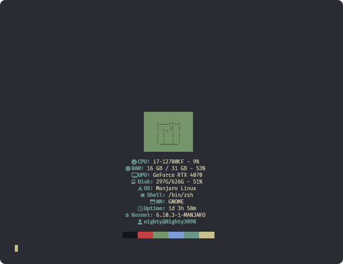
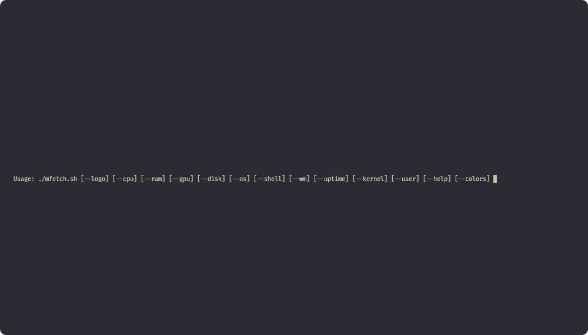
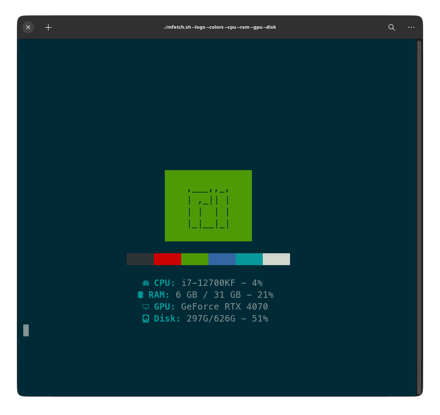
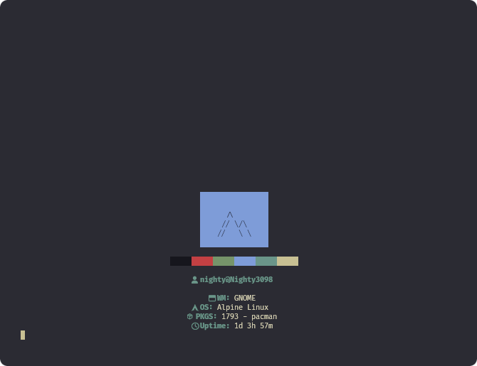
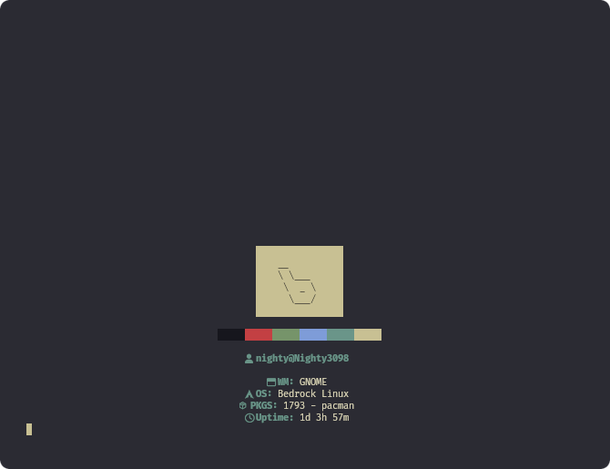
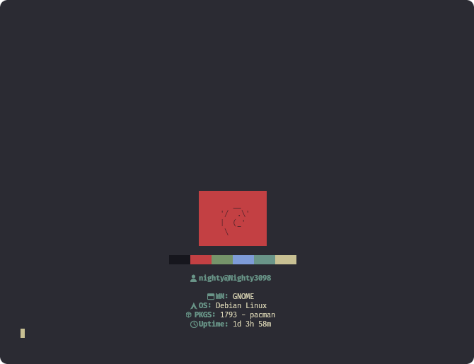
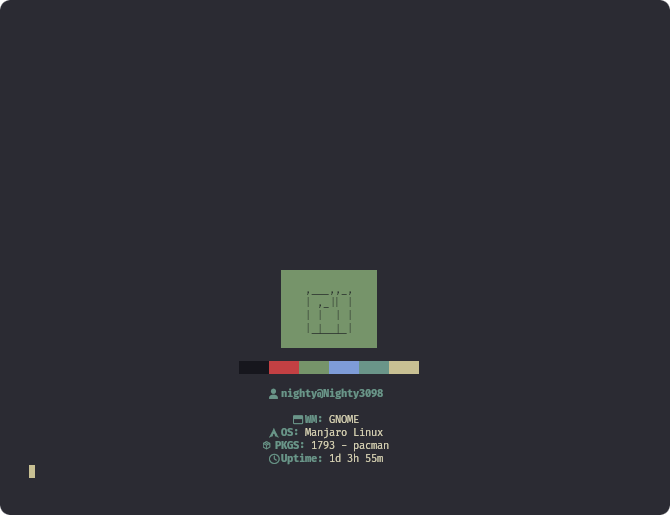
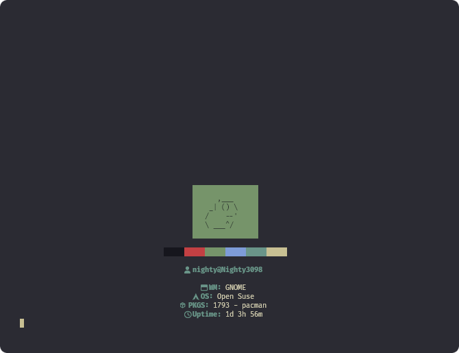

<div align="center">

<h1>mFetch</h1>
<h3>🛠️ A simple fetch tool for Linux written in bash</h3>

<a href="./LICENSE.md"></a><br>


<br><br><br>


<h3>Usage</h3>
</div>

```
git clone https://github.com/DXS-GROUP/mfetch
cd mfetch
mv mfetch.sh mfetch && chmod +x mfetch

./mfetch
Usage: ./mfetch [--logo] [--cpu] [--ram] [--gpu] [--disk] [--os] [--shell] [--wm] [--uptime] [--kernel] [--user] [--help] [--colors]
```

<div align="center">
<br><br>

<details>
<summary>Gallery</summary>
    <br>
    
    <br>
    
    <br>
    
    <br>
    
</details>

<br><br>

<details>
<summary>Systems</summary>

<h3>arch</h3>


<h3>alpine</h3>



<h3>bedrock</h3>



<h3>debian</h3>



<h3>endeavouros</h3>


<h3>manjaro</h3>



<h3>open suse</h3>


</details>

</div>
